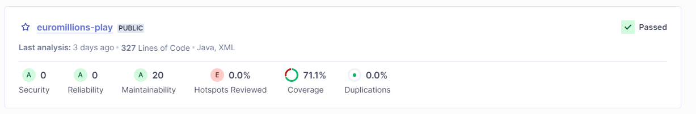

# LAB6_1

user token: squ_b6a7ba3f197c02ee8f997f5c7cb4706098d5b49a

## 1.

## F.

Code smell (medium) - Refactor the code in order to not assign to this loop counter from within the loop body.\
Code smell (medium) - Remove this unused import 'java.security.NoSuchAlgorithmException'.

0 Bugs\
0 Vulnerabilities